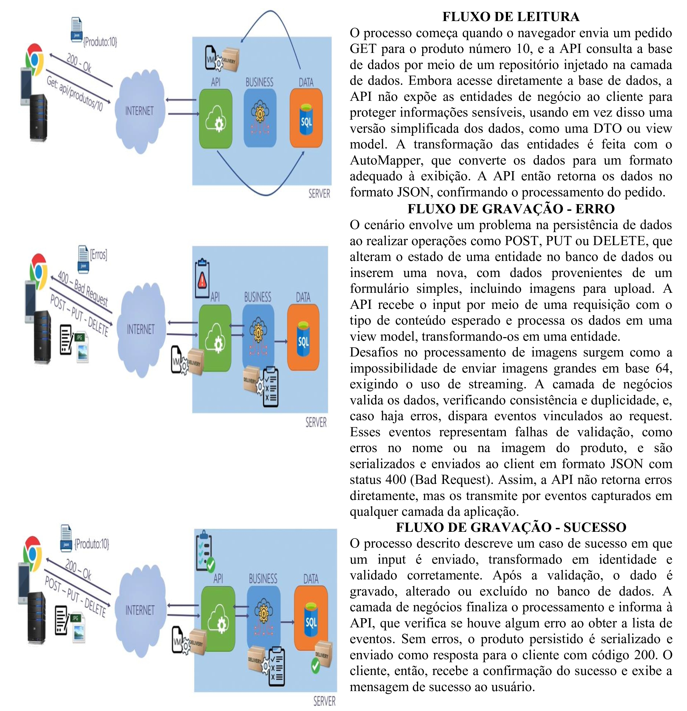

# REST com ASP.NET Core WebAPI 

## 📝️ Escopo do Projeto

<p align="justify"> 
O projeto envolve três entidades na camada de negócio que interagem com o banco de dados. 
A entidade Fornecedor possui regras de negócios e validações, representando uma tabela no banco de dados. 
Ao cadastrar um fornecedor, é necessário também cadastrar seu Endereço, que também é uma entidade com 
validações e regras, representando uma tabela no banco, e tem um relacionamento 1:1 com o fornecedor, pois 
cada fornecedor possui apenas um endereço.
</p>

<p align="justify"> 
Além disso, existe a entidade Produto, que também segue a mesma estrutura, com validações e regras na camada 
de negócio. O relacionamento entre Fornecedor e Produto é 1:N, onde um fornecedor pode ter vários produtos 
associados. O projeto permite o cadastro, alteração e gestão desses dados (fornecedor, endereço e produtos) 
através de uma API, que integra a camada de negócio e acesso a dados. As funcionalidades incluem cadastro 
e alteração de fornecedores e endereços, bem como a gestão de produtos e imagens associadas a cada fornecedor.
</p>

## 🛠️ Construído com

* [Visual Studio 2022](https://learn.microsoft.com/pt-br/visualstudio/windows/?view=vs-2022) - Ferramenta de desenvolvimento, que permite realizar todo o ciclo de desenvolvimento em um só lugar.
  
## 📚 Principais Bibliotecas, Frameworks e Comandos do NuGet Utilizados

* [net6.0](https://learn.microsoft.com/pt-br/dotnet/core/whats-new/dotnet-6) - Versão da plataforma de desenvolvimento .NET, que é de código aberto e multiplataforma, desenvolvida pela Microsoft.

```
dotnet add package Microsoft.NET.Sdk.Web --version 6.0.0
```

* [AutoMapper](https://automapper.org/) - Foi utilizada essa biblioteca para mapear objetos.

```
NuGet\Install-Package AutoMapper -Version 11.0.0
```

* [Swashbuckle](https://learn.microsoft.com/pt-br/aspnet/core/tutorials/getting-started-with-swashbuckle?view=aspnetcore-8.0&tabs=visual-studio) - 
Foi utilizado essa biblioteca facilitar a criação de uma interface visual para testar, explorar e documentar as APIs, sem a necessidade de escrever manualmente a documentação.

```
NuGet\Install-Package Swashbuckle.AspNetCore.Swagger -Version 6.3.0
```

* [FluentValidation](https://docs.fluentvalidation.net/en/latest/) - 
Foi utilizada essa biblioteca para validação de objetos.

```
NuGet\Install-Package FluentValidation -Version 10.3.6
```

* [Microsoft.EntityFrameworkCore](https://learn.microsoft.com/pt-br/ef/core/get-started/overview/install) - 
Foi utilizado esse ORM para interagir com bancos de dados usando objetos.

```
NuGet\Install-Package Microsoft.EntityFrameworkCore -Version 6.0.3
```

* [Elmah](https://learn.microsoft.com/pt-br/aspnet/web-forms/overview/older-versions-getting-started/deploying-web-site-projects/logging-error-details-with-elmah-cs) - 
Foi utilizada essa biblioteca para registrar e monitorar erros de aplicação em tempo real.

```
NuGet\Install-Package Elmah.Io.AspNetCore -Version 4.1.37
```

## 🚧 Fluxo da Arquitetura do Projeto

Fluxo da arquitetura segundo a imagem abaixo é composta da seguinte forma:



## 🚧 Descrição da Estrutura do Projeto

A estrutura do projeto segundo a imagem abaixo é composta da seguinte forma:


## ⚠️ Atenção

Destinado exclusivamente para fins de estudo.

---
⌨️ por [Byron Doria](https://gist.github.com/lohhans) 😊
